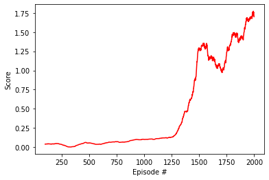

# Project 1: Continuous Control
## Learning Algorithm
This project uses Multi Agent Deep Deterministic Policy Gradient (MADDPG) to solve an environment with multiple Agents in a continuous action Space.
### MADDPG
Multi Agent Deep Deterministic Policy Gradient (DDPG) was first intruduced in [this paper](https://proceedings.neurips.cc/paper/2017/file/68a9750337a418a86fe06c1991a1d64c-Paper.pdf)
It is an extension of DDPG to multiple agents, using centralized critics with decentralized actors.  Each agent has its own critic, but the critic has access to the state observations and action selections of all agents.  Each agent has its own actor which only has access to its own state observation.  This means that after training, at run time each agent can act independently without knowing about what the other agent is doing.

The algoritm works a follows:

    1. For each agent, initialize local network, and target network (copying the weights from the local network) for both the Actor and the Critic
    2. Initialize a single replay buffer which all agents share
    For each episode do:
        3. initialize environment
        for each timestep do:
            4. Each Agent chooses an action for the current state using the Actor network.  Since the actor network is deterministic noise is added to make the agent explore
            (The original paper used Ornstein–Uhlenbeck noise, however my implementation uses gaussian noise)
            5. Each agents takes the actions and observe the next state and reward
            6. Store the States, Actions, rewards, next states (1 of each for each agent)in the replay buffer
            7.  Every N timesteps, if there are enough experiences in the replay buffer then train the target networks M times:
                8. Select a random mini batch of experiences from the replay buffer
                Train the Critic
                    9. Select actions to take in the next state using the target Actor network for each agent
                    10. For each agent, set the expected Q value to that agents reward + the discount rate  * the Q value (from the target Critic network) for the concatenatenation of all next actions and all next states
                    11. For each agent, step the local Critic network optimizer to bring the Q value closer to the expected Q value
                Train the Actor:
                    12. For each agent, predict the Best action to take in the current state using the local Actor network
                    13. Each agent uses a loss function of the negative of the predicted Q value for the concatenated actions and states from the local Critic network
                    14. Step the local Actor network optimizers to minimize the loss
                16. Every N steps perform a soft update to bring the Target networks weights closer to the local networks weights
                16. Decrease the size of the added noise
                

### Network Architecture
The Actor network used here is:  
State Input  
Batch Normalization  
512 Fully Connected units  
Batch Normalization  
Relu Activation  
256 Fully Connected units  
Batch Normalization  
Relu Activation  
Action Size Fully Connected units with Hyperbolic Tangent Activation  

The Critic network used here is:  
State Input  
Batch Normalization  
512 Fully Connected units  
Batch Normalization  
Leaky Relu Activation  
Concatenate with Action Input  
256 Fully Connected units  
Batch Normalization  
Leaky Relu Relu Activation  
1 Linear Node  

### Hyperparameters
I use the Following hyperparameters:  
update_every=10: Number of timesteps before the agent learns (N in step 7 above)  
learn_n_times=5: Number of times to train the networks (M in step 7 above)  
noise_scale=0.2:  The initaal Standard Deviation of the added gaussian noise  
noise_decay=0.9999: Each time the Agent learns it multiplies the noise scale by this  
lr_actor = 5e-4: The learning Rate for the Actor network  
lr_critic = 5e-4: The learning Rate for the Critic Network  
BUFFER_SIZE = int(1e6):  The replay buffer size  
BATCH_SIZE = 256: The training minibatch size  
GAMMA = 0.95: The reward discount factor  
TAU = 1e-3: For the soft update of target parameters  
WEIGHT_DECAY = 0: L2 weight decay for the Critic Network  

### Results
This agent set was able to solve the envronment in 13992 epsodes with an average score of 0.51, continuing to train the set was able to imporve the average score to 1.7 (averaged over 100 episodes) after 2000 episodes
Below is a plot of the score for each episode

### Future Work
To improve this project I could implement prioritized experience replay to improve performance. 